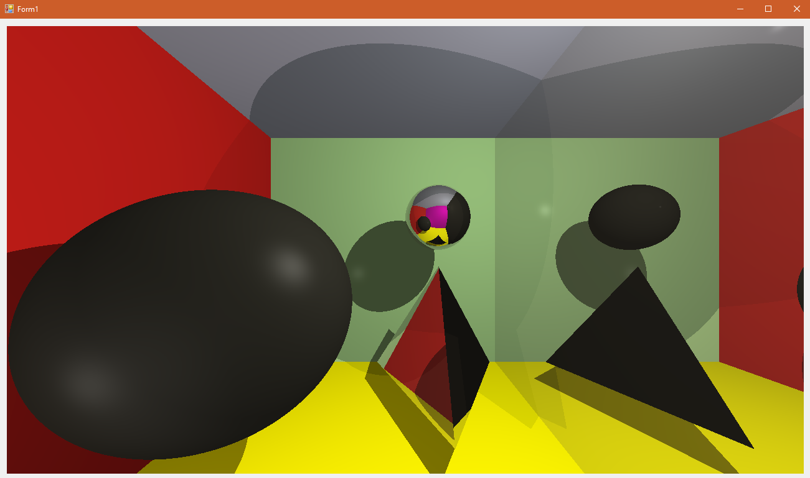
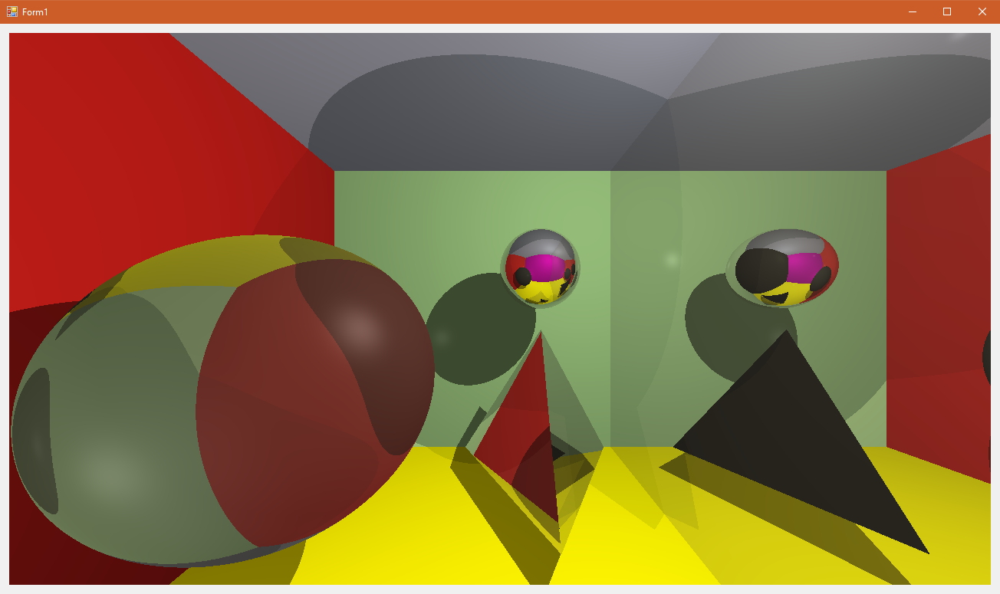
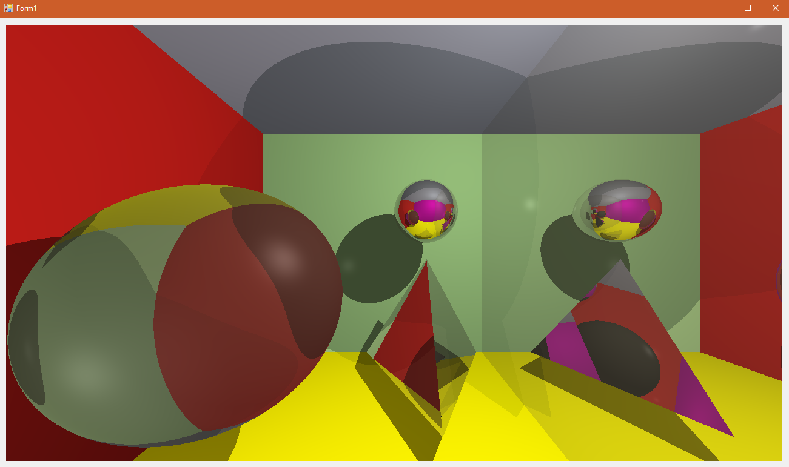
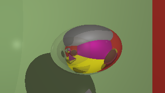

# CG_3

Рухович Игорь

381808-1

Отчёт по лабораторной работе №3. Трассировка лучей.

Так выглядит окно приложения:

На изображении находится куб из шести стен размером $10 \times 10$. правая стена куба - зеркальная. Она отражает 80% световых лучей, а остальные рассеивает.

Внутри куба, помимо камеры, находятся две сферы и тетраэдр. Маленькая сфера (справа) и тетраэдр, как и правая стена, имеют зеркальный вид (коэффициенты  те же). Большая сфера похожа на стекло. Показатель преломления среды в ней - 1.5. Она пропускает 70% входящего света и рассеивает остальную часть.

Внутри куба также находятся два источника света. Один из них расположен в левом нижнем углу практически за камерой и светит светло-розовым светом с интенсивностью 0.3 относительных единицы. Другой расположен в правом верхнем углу перед камерой и светит светло-желтым светом с относительной интенсивностью 0.6. Все объекты на сцене отбрасывают тени от обоих источников света. Наложения теней суммируются (как в жизни).

На первой картинке глубина трассировки составляет 100 попыток. Далее будут приведены примеры с другими глубинами:

1 попытка. Отображаются только объекты, имеющие конкретный цвет. На остальных же луч не успел отразиться / преломиться, чтобы попасть в конкретный цвет. Поэтому эти объекты выглядят чёрными:

2 попытки. Зеркальные объекты сделали первичные отражения и практически целиком получили свой цвет. Тем не менее в местах где зеркало смотрит на зеркало по прежнему виден чёрный.:

3 попытки. Луч впервые прошёл сквозь стеклянный объект и практически полностью заполнил его цветом.:

5 попыток. Практически вся картинка восстановлена, тем не менее остались несколько мест, где недостаточно пяти лучей для получения результата:

100 попыток. На картинке не осталось чёрных элементов. Отражения рассчитаны с большой точностью:

Отражение в шаре из отражения (справа на оригинальной картинке):